# Torrent Inspector 1.43.8

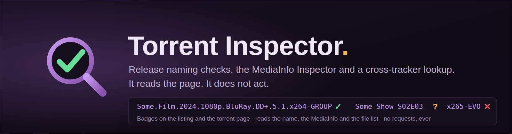

A Tampermonkey userscript for release naming. It reads the page you are on and tells you
whether a release name is written the way the tracker you are on says it should be — on the
listing, on the torrent page, and in a MediaInfo panel you can paste a report into. It also
looks a release up on the other trackers you are a member of, compares two releases side by
side, keeps the templates you paste over and over, and moves you around a tracker by page or
by torrent ID.

**It reads. It does not act.** No network request of any kind, no account, no cookie, no API
key, nothing posted, submitted, uploaded or downloaded. Every link opens when you click it and
not before. What it stores, it stores on your own machine.

It runs on **45 UNIT3D trackers** and can search **63**, and it also runs on TorrentLeech and
FileList for the lookups and the source check. Naming rules for DarkPeers, Zenith, LUME,
OnlyEncodes+, HomieHelpDesk, MidnightScene and InfinityHD ship with it; any other tracker is added by
pasting its rules, as data, never as code.

## New in 1.43.8

FileList now compares the ID remembered from its own Media Info page when you return
to torrent details. Saved evidence is labelled, and full report filenames are shared
with the other supported trackers. FileList and TorrentLeech also refresh their source
panels on tab return. Each tracker keeps its own facts so differences remain visible.

## New in 1.43.7

The open Source check panel now updates when page evidence loads or changes and when
you return from another tracker tab. No closing and reopening is needed. Your notes,
expanded or collapsed comparisons, and checkbox focus stay in place.

## New in 1.43.6

The website now leads with the unified review workflow. Its tutorials, screenshots,
demo instructions and navigation match the current panel. The install link downloads
the script bundled with that site release, and the site includes the current guide
and changelog. Upload the complete website folder together to publish the update.

## New in 1.43.5

Fixed a false Dual-Audio warning when the page says **Primary Language es** and its
audio tracks include **Spanish** and **English**. The field label is removed before
checking; ISO language codes and their names are compared consistently. Genuine
missing-original and English-original warnings remain.

## New in 1.43.4

Source check shows the current torrent's filename, Unique ID, folder and size at the
top, with the available full filename preserved. Tracker comparison rows start open,
so their filenames, ID evidence and return links are visible immediately. Collapse
individual rows when finished. Automatic notices remain compact.

## New in 1.43.3

**Source check** in the tools bar now opens the unified panel directly. Its Source check
tab shows every current comparison, with separate counts for ID matches, name/size
matches and ID mismatches. Expand a tracker row for the full filename, IDs and link.
The current fingerprint and the last saved check from another page are folded below,
so a single older answer is no longer mistaken for the complete source results.

Automatic source notices, if enabled, also use compact expandable rows. Your existing
**Only show this when I press Source check** preference is kept.

## New in 1.43.2

Torrent pages are quieter now. Under the release name, **Inspect torrent**, **Find other
releases** and **Compare releases** replace the rows of lookup buttons. IMDb, TMDB and
TVDb remain small reference links where the category makes them useful.

**Find other releases** opens the new **Find releases** tab in the unified panel. Edit
the search, choose **Title** or **Exact release**, and use one grid of your enabled
trackers. Title searches keep the season or episode. Quality choices add a search term;
exact searches keep the full release name. **More lookup sites** holds srrDB and the
other reference sites, plus Copy title. The same search controls are available on
TorrentLeech and FileList. Request pages keep their existing cross-check tools.

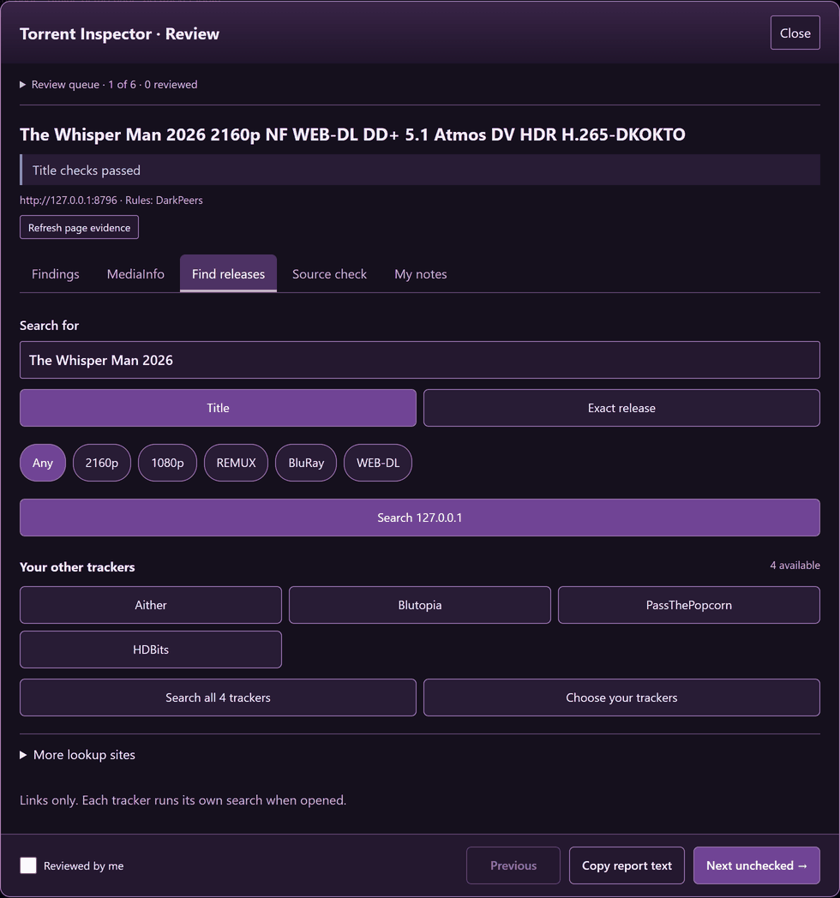

## New in 1.43.1

**Inspect torrent** on an individual torrent page now opens the same unified Review
panel as the listing. There is one inspection button in the tools bar. The panel also
works when no naming rule set is selected: MediaInfo, Source check and My notes stay
available, while Findings clearly says that naming checks were not run.

MediaInfo now has summary cards, video details and audio/subtitle tables. The full
technical report is folded below them. Pasted reports and comparisons remain available
through **More tools & naming template → Open Inspector for advanced tools**.

## The unified review workflow

**Review loaded titles** opens one panel with **Findings**, **MediaInfo**, **Find releases**, **Source check**
and **My notes** tabs. On a torrent page, use **Inspect torrent** or click its naming badge.
The queue follows actual links from the listing you loaded. **Previous** and **Next unchecked**
continue the panel on the next page; your tab, manual checks and private notes stay with the
torrent. Notes save as you type, and older Inspector notes remain available.

**Reviewed by me** records your progress locally. It does not change the naming verdict,
hide errors, approve a torrent or invoke **Mark as conforming**. The report button stays in
the footer. Naming templates and the full Inspector are under **More tools & naming template**.

**Settings & tools** keeps automatic checks, audits, tracker choices, rules, backups and
logs together. The full Inspector still handles pasted reports and detailed comparisons.

## What it looks like

Every image here is rendered from this project's own offline demo pages — synthetic release
names, no tracker branding, no usernames, no ratios, nothing from a real site. They are
regenerated from the current build, so they cannot drift away from what the script does.

**The Review panel** keeps the queue, evidence tabs and next step together:

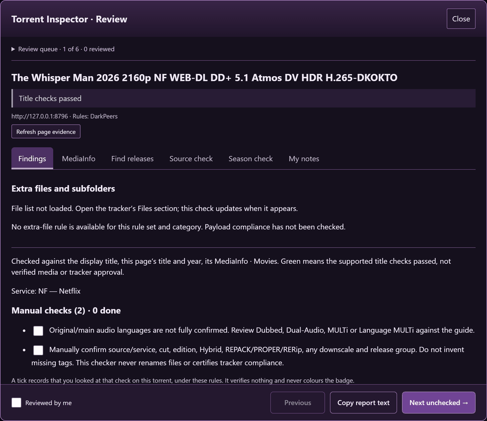

**On a listing** — a badge per loaded title, and the bar that turns them on:

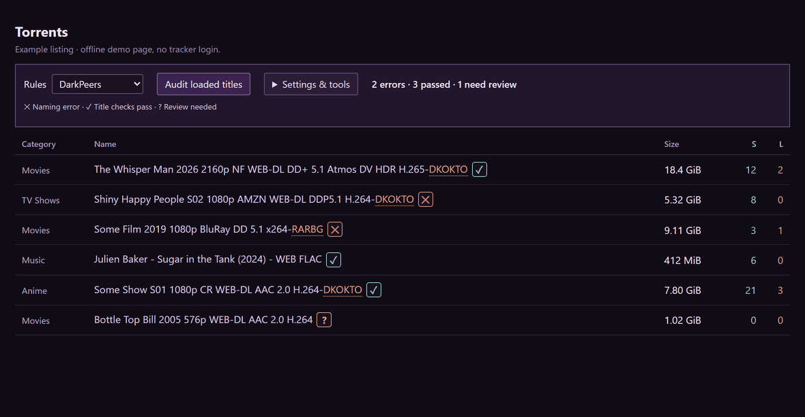

**Click a badge** and it says what it found, what it could not decide, and what the tracker's
template asks for:

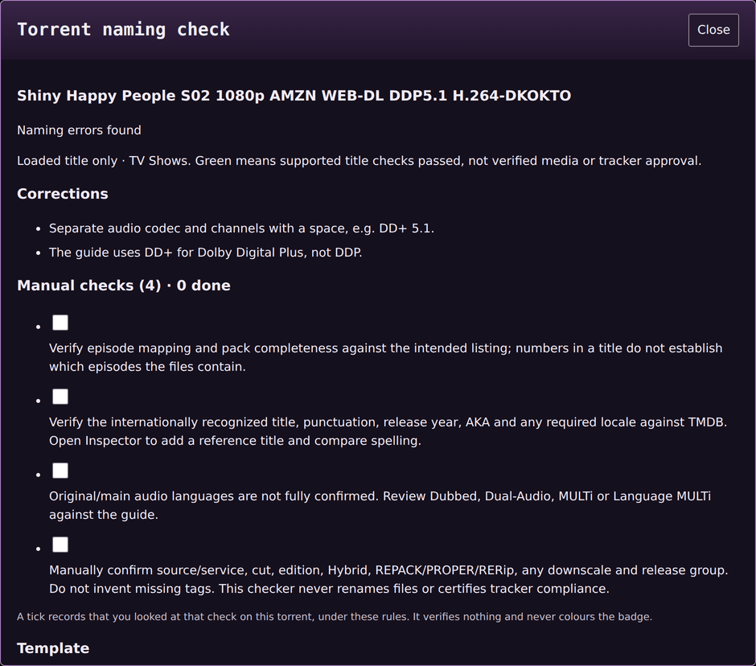

A banned or low-quality group is named with the list it is on, and the reason that list gives:

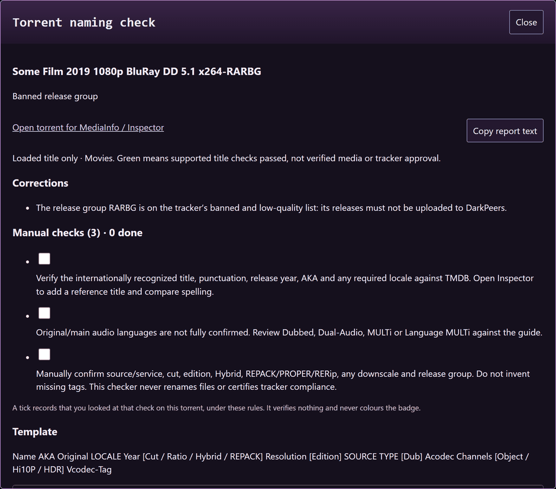

**On a torrent page** — the badge on the release name, the compact inspection and lookup actions, the
**Compare releases** button, and the file marker with the exact byte count:

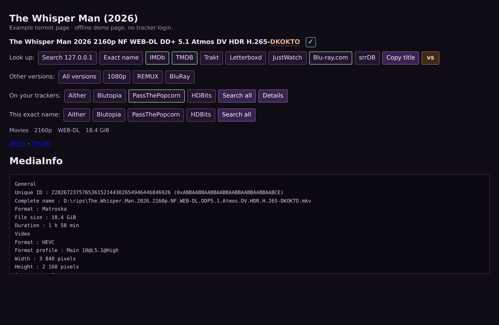

**The source check** — open the same release on a second tracker and the banner says whether
it is the same file: Unique ID, file name, size to the byte, and a link back:

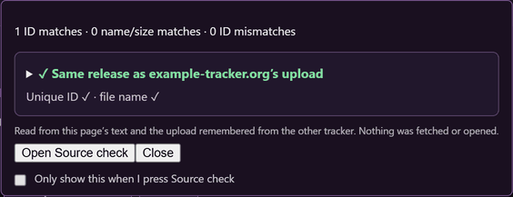

The **Source check** button in the tools bar opens the unified panel with every current
comparison in an expandable row. The current fingerprint and the last saved answer
from another page are labelled separately below the comparisons:

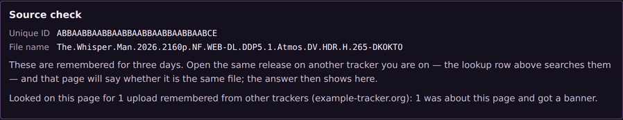


**MediaInfo on a torrent page**, in the unified panel:

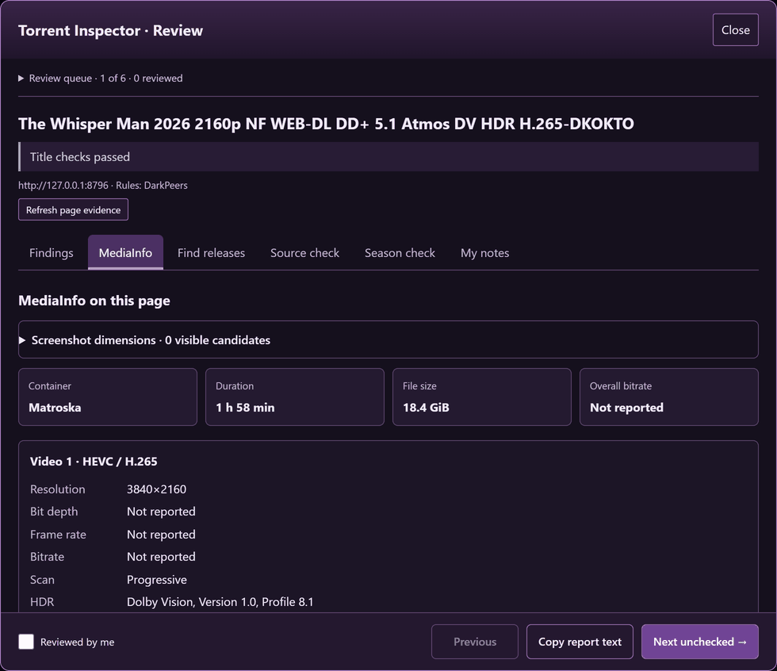

**The advanced Inspector** reads the MediaInfo already on the page and checks the name against it:

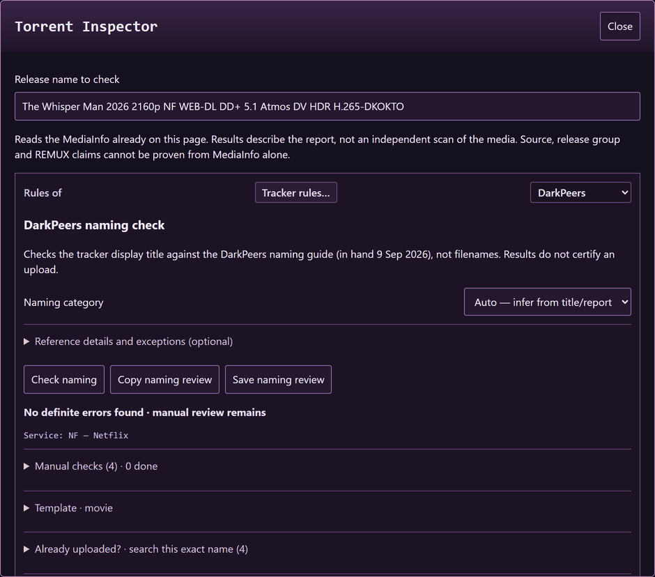

**Torrent nav** moves you by listing page or by torrent ID, on any tracker this runs on:

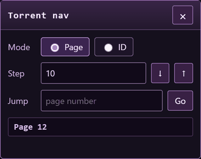

**On the requests page**, each request gets a search link for every tracker that can carry
that kind of request — and a tracker that cannot is left out with the reason:

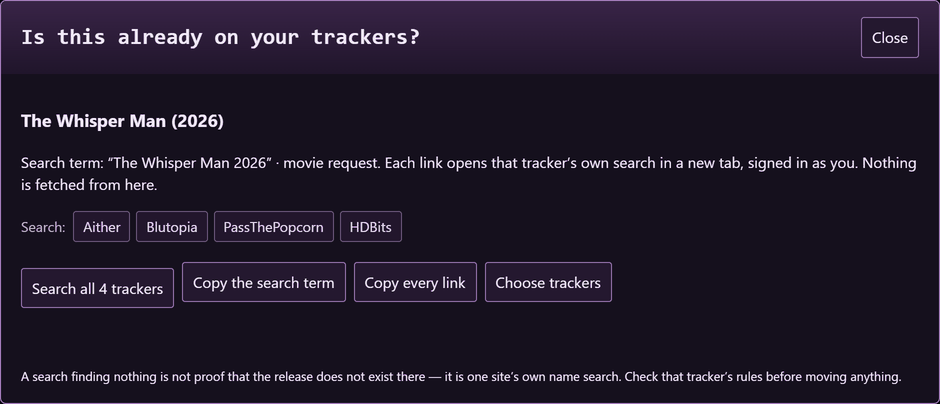

---

## Install

1. Install Tampermonkey, if you have not.
2. Open **`Torrent-inspector.user.js`** and let Tampermonkey install it. Do not double-click
   the file as a Windows script.
3. That is all. Nothing to sign in to, nothing to configure before it works.

Updates come to you: the script carries `@updateURL` and `@downloadURL`, so Tampermonkey
checks for a new version on its own schedule and offers it.

### If you had it installed before 1.26.0

It was called *DarkPeers - Torrent Inspector* and its file was
`DarkPeers-Torrent-Inspector.user.js`. From 1.26.0 it is just **Torrent Inspector**, because it
is not DarkPeers' script and never was — it runs on 45 trackers.

Tampermonkey identifies an installed script by what is in its header, so the rename can land
as a **second entry in your script list** rather than as an update to the first. If you see
two, keep the new one and delete the old — running both at once means two copies of every
badge.

Your settings should survive that. Everything this script saves — added trackers, rule sets,
the internal-groups list, your templates — is written to two places at once: Tampermonkey's
own per-script store, and ordinary browser storage on the tracker you were using at the time.
A fresh install reads the second one and adopts it, per site. If you have set up a lot and
want to be certain, open **Tracker rules… → Added trackers**, press **Export**, and keep the
JSON somewhere before you update.

## What you need to read

- **This file** — what it does, and what changed in the latest versions.
- **GUIDE.md** — the walkthrough, written for this script: the badges, the rules, the torrent
  page, the templates, the Inspector, and what it will never do. Start people here.
- **TRACKER-RULES.md** — how to add a tracker of your own, as a rules profile.
- **CHANGELOG.md** — every version, newest first, in more detail than here. The version
  notes below stop at 1.39.0; everything earlier is there.

## Fixed in 1.42.3

**The demo survives a reload.** The first cut of the live demo faked the page address so the
script would treat the page as a torrent page, and a reload landed on the host's 404. The
three pages now live at the real addresses the script expects — `/torrents/`,
`/torrents/101/` and `/requests/` on the site — so a reload, a bookmark or the listing's
own link to the torrent page all just work. The old `demo.html` names redirect there.

## New in 1.42.2

**The website has a live demo, and a once-over.** torrent.dkokto.dev now has three demo
pages — a listing, a torrent page and a requests page — made-up releases running the real
script, so you can click the badges, open the Inspector and see the source-check banner
without installing anything. The front page was cut down and brought up to date (seven
rule sets, the source check with its own section and screenshots, the numbers as they are
now), and the screenshots here and there were regenerated from this build. The script
itself is unchanged.

## New in 1.42.1

**The banner can wait to be asked.** By default the source-check banner appears on its own
the moment you open a page that matches an upload remembered from another tracker. If you
would rather it stayed out of the way until you ask, there is now a box for that, in the
banner itself:

1. On any torrent page, press **Source check** in the tools bar (or wait for a banner to
   appear on its own).
2. At the bottom of the banner, tick **Only show this when I press Source check**.

From then on nothing appears by itself; the page is still read and remembered, and
pressing **Source check** shows what it found. To go back, press **Source check**, untick
the box, and the banner appears on its own again. The setting is kept with the source
check's own record, so it holds across every tracker the script runs on and travels with
**Backup…**. Off by default.

## New in 1.42.0

**A Source check button in the tools bar.** Next to *Nav* and *Inspect torrent* there is
now *Source check*. Press it and the banner comes back after you have closed it — the same
rows, the same links. On a page where no banner appeared, it puts a small box in the
banner's place saying what the page was looked over for and why nothing matched, so a
quiet page is never a mystery. Close works on both. Nothing is fetched by pressing it; it
shows what the page already told the script.

## Fixed in 1.42.6

**The profile builder can say everything a profile can.** Three fields had crept into the
format that the *Build one* form — in the script and on the rules page — had no box for:
a tracker that names its books its own way, one that names its music its own way, and one
with a folder standard for audiobooks. A profile with them pasted in fine, but you could
not build one. The form now has the three boxes and a field for the resolutions the
tracker's guide lists, and the *Added trackers* summary says when a profile uses them.

## Fixed in 1.42.5

**The demo is a whole small site now.** Every row on the demo listing has its own torrent
page and every request its own request page — six torrents and three requests — and each
one shows a different thing: the source-check banner, a season pack with an episode
missing from its files, a banned group, a music release, an anime pack whose only audio
track is not the original language, and a name with no group tag that gets an amber
question. Nothing on the demo links to a page that is not there.

## Fixed in 1.41.3

**A music torrent page gets its badge.** A MidnightScene single's page showed nothing
under its name at all, for the reason books had until 1.40.0: a music name does not look
like a release to the script, so it had nothing to hang the badge on. On a page filed
under Music it now takes the page's own heading, as it does for books, and the tracker's
music rules read it — on that single, MidnightScene's "primary artist only" rule turns the
`ft.` credit into a red ✕. Nothing changes for video pages.

## New in 1.41.2

**The repository has a face.** A logo (the lens with the tick), a banner at the top of this
file and a social preview card, all in the site's own purple, drawn from scratch as SVG
and rendered to PNG; they live in `images/`. The site's pages now carry the logo as their
icon. Nothing in the script changed.

## Fixed in 1.41.1

**`craftwork` is the group on Zenith's music rows, and it says so.** 1.40.1 stopped the
wrong thing being highlighted on `LITE - Cubic (2016) - [CD FLAC 16bit-44kHz] - craftwork`
but left the row with no group mark at all, and said that was right. It was not: the group
on Zenith's music shape sits after the bracketed format, behind a spaced " - ", and it is
a group like any other. One word straight after `] - ` is now read as the tag and gets the
mark, with its menu; two or more words there (a subtitle) are left alone.

## New in 1.41.0

**InfinityHD.** Its Banned Release Groups page and its Naming Guide came in as text on
23 September, and both are in the script now: the script runs on infinityhd.net, the
tracker is searchable from the lookup rows, and its rule set is the default there. The
guide's two templates are the same element order the script already checks, so the shared
checks apply as they do on OnlyEncodes+ and LUME, and on top of them InfinityHD's own
vocabulary: DD+ not DDP, Atmos not Dolby Atmos, H.264 with the dot, H.264/H.265/VP9/AV1 on a
WEB-DL and x264/x265/AV1 on an encode, BluRay one word on remuxes and encodes, Dual-Audio
hyphenated, REPACK2 joined, S01-S03 COMPLETE, and an HDR list that reads HDR, HDR10+, DV,
DV HDR10+, HLG, PQ10 — so "DV HDR" on its own is called out there, because the guide does
not list it. Its resolution list is 1080i, 1080p, 2160p and 4320p, so a 720p name is told it
is not on the list; whether the site takes 720p in practice is something the guide does not
say. The 126 banned groups are carried as the page prints them, with no reason per name
because the page gives none. Two things to know: no page of the site has been seen, so the
search address is the usual UNIT3D one until a search page says otherwise, and the upload,
description and trumping rules were not supplied, so nothing is claimed about them.

**An HDTV capture may say H.264.** The shared check meant to allow H.264, H.265, VP9 and
AV1 on HDTV captures as well as x264/x265, but the test that chose that list could never
match, so every capture was held to the encode list and "1080p HDTV DD 2.0 H.264" was
told to say x264. Found while writing InfinityHD's examples; fixed for every tracker.

## Fixed in 1.40.1

**The byte count is on the banner's line too.** `size ✓ (1.85 GiB, 1,986,422,784 bytes)`:
the rounded size is what a page shows at a glance, the exact count is what its file list
carries, and the exact one is what you compare.

**Zenith's music rows had the wrong thing marked as the group.** In
`LITE - Cubic (2016) - [CD FLAC 16bit-44kHz] - craftwork` the hyphen inside `16bit-44kHz`
was being read as the start of a group tag, and `44kHz] - craftwork` got the group
highlight. A closing bracket is not part of a word, and a tag never runs across a spaced
" - ", so that stops; the two rows now carry no group mark, which is right — the
internal-groups directory is not what `craftwork` is.

## New in 1.40.0

**HomieHelpDesk's audiobook standard is checked.** Its Audiobook Naming and Folder Standard
was pasted in on 22 September, and an audiobook on that tracker is now held to it from the
torrent page. The name has to read `Author - Title (Read by Narrator)`, with the M4B name
matching it; a URL or a group tag in the name is called out. The file list is read too:
everything has to sit in one root folder named like the release, the tracks have to be
numbered with two digits (three once there are a hundred or more), and an NFO, a text file
or a URL file among them is flagged. Tags, companion files and the like are left to you and
said so in a standing note. This is the first time a book's name gets a badge on a torrent
page at all — book names never looked like releases to the script, so it had nothing to
hang the badge on; on a page filed under Audiobooks or E-Books it now uses the page's own
name heading, on every tracker, so the existing book rules reach the torrent page too.

**The size is on the banner's line.** Where the source check said `size ✓`, it now says
`size ✓ (20.40 GiB)` — the size it compared, taken from the remembered upload — so a tick
can be checked against the page by eye, and a cross says which size it was looking for.

**A group tag after the format no longer puts an amber ? on Zenith's music.** A row like
`Aphex Twin - ...I Care Because You Do (2009) - [CD FLAC 16bit-44kHz] - craftwork` follows
Zenith's suggested shape; the check wanted the name to end at the closing bracket. Zenith's
own rule 1.4 keeps the original group tag, and only the artist and album are required, so a
single word after the format is accepted. (The dots at the start of that album are its
title, not the page cutting the name short; that was never what the ? was about.)

## Fixed in 1.39.5

**This file is a sixth of the size.** It used to carry every version note back to 1.1.0,
which is what the CHANGELOG is for; now it describes the script as it is, keeps the 1.39
notes, and points at the CHANGELOG for the rest. The description at the bottom was written
fresh, since the old one still described the script as it was in 1.8.

**The source-check modules read like prose now.** The five files behind the source check
and the TorrentLeech / FileList pages were written fast this week, in one-line-per-function
style with comments to match. They are laid out and commented the way a person would
explain them, with nothing about what they do changed — every check and fixture is the same
count as before. Nothing else in the script was touched.

## Fixed in 1.39.4

**A tidy-up, nothing new to see.** The check scripts no longer leave a transcript file
beside the package after every run (there were 67 of them, rewritten each time and read by
nobody); the page-text reader the source check uses now lives in one place instead of two
slightly different copies; a few unused leftovers from the TorrentLeech / FileList work are
gone; and the file that records where every tracker address came from is now called
`TRACKER-ADDRESSES.txt`, which is what it is.

## Fixed in 1.39.3

**The FileList panel no longer breaks the page's box.** It was being put between the header
strip and its right-hand cap, which pushed the frame apart; it now sits first inside the
content box, above the download link, with the frame intact.

## Fixed in 1.39.2

**The badge no longer lands on a file name quoted in the description.** On a HomieHelpDesk
page whose Release Notes quoted the NFO, the script took the NFO's file name for the
release name — it reads like one and was shorter than the page's long "AKA" title — badged
it red, and then reported that the page's own name disagreed with it. The description is
the uploader's text, never the page's name, so it is left out of the search now, and the
page's own name element wins a tie. On that page the badge is where it belongs and the name
passes.

## Fixed in 1.39.1

**Choosing trackers from TorrentLeech and FileList.** The panel there had no way to open the
"Trackers you are on" dialog, so a tracker you hadn't ticked yet — FileList itself, newly in
the catalogue — couldn't be added without going back to a UNIT3D page. There's now a
**Choose trackers…** button beside Copy title; tick one and the rows update on the spot.

## New in 1.39.0

**TorrentLeech and FileList.** Neither runs UNIT3D, and until now the script could only build
a search link to them. It now runs on their torrent pages as well — not to judge the name,
since neither has a rule set, but for the two things that matter when you are chasing a
source: the lookup rows and the source check. Under the name you get a small panel with
this tracker's own search, the usual IMDb / TMDB / srrDB lookups, your other trackers, and
the Source check section; the upload is remembered like any other, and the banner appears
there when you arrive from a tracker where you had the same release open.

What each site can and can't say. TorrentLeech has the file list and the size on the page
but no MediaInfo, so there is no Unique ID to compare; the banner says *✓ Same name and size
as … (no Unique ID to compare)* when that is all it has, rather than pretending to more. It
also prints file names in lower case, which the check allows for and marks as *case differs
there*. FileList keeps the file list in a tooltip and the full MediaInfo on a separate Media
Info page for the same torrent; the panel on the details page points you at it, and opening
it fills in the Unique ID for that upload — details page and Media Info page are one
torrent to the script. FileList is also in the searchable trackers now, with the address
you gave.

## Everything before 1.39.0

Is in **CHANGELOG.md**, one entry per version back to 1.1.0. The notes used to be repeated
here as well, which made this file ninety kilobytes of history with the description at the
bottom; now the description comes next.

## What it does

**On a listing page.** Every loaded release name gets a badge: a red ✕ when the name breaks a
rule of the tracker you are on, a green ✓ when it passes the checks the script can make, an
amber ? when there is something you need to decide yourself. Click one and it says what it
found, what it could not decide, what the tracker's template asks for, and which manual
checks are left — each of those with a tick box that stays ticked for that torrent. A banned
or low-quality group is named with the list it is on. The bar keeps Rules, Review loaded
titles and counts visible. Settings & tools contains the on/off switch, setup and audits.
The badges follow filtering and paging without any request of their own.

**On a torrent page.** The same badge on the release name, compact metadata links and three
actions: **Inspect torrent**, **Find other releases** and **Compare releases**. Find releases
holds the editable query, Title / Exact release modes, quality choices and tracker grid;
More lookup sites keeps the remaining references. A marker reads the file list and says
what the torrent actually holds, to the byte. **Compare releases** captures this release so you can open
another and compare the two side by side. The page's own MediaInfo is read and checked
against the name, and the file list is read and checked against the name too, so a pack
that says S01 and holds three episodes is caught.

**The source check.** Opening a torrent remembers what makes the upload what it is — the
report's Unique ID, the file name, the folder, the files and the sizes — for three days. Open
the same release on another tracker and **Source check** opens the unified comparison tab.
Current filename, ID and size appear above expanded tracker rows. ID matches, name/size-only
matches and mismatches are distinguished, and the last saved check on another page is labelled
separately. Automatic notices can be hidden using the quiet checkbox. When nothing matches,
the tab explains what was checked. A report whose Unique ID's decimal and hex halves disagree — and a
report whose file size is not the file on the page are caught on the page itself.

**Inspect torrent** opens unified Review on a supported torrent page, with Findings,
MediaInfo, Find releases, Source check and My notes. MediaInfo shows summary cards and
track tables. Pasted reports and advanced inspection remain under Findings → More tools →
Open Inspector for advanced tools. The standalone shortcut is Alt+Shift+I.

**Rules.** DarkPeers, Zenith, LUME, OnlyEncodes+, HomieHelpDesk, MidnightScene and InfinityHD ship with
the script and are in force on their own trackers. Any other tracker is added by pasting its
rules as a profile — data, never code — and **TRACKER-RULES.md** shows how. A tracker with no
rules gets the group tag marked and nothing else judged, because the script does not guess
what a tracker wants.

**Also.** Release-notes templates with a button beside the comment box; a request-page
cross-check that gives each request a search on every tracker that can carry that kind of
thing; torrent nav, which moves you by listing page or by torrent ID; and Backup…, which
saves everything the script keeps as one file you can bring to another browser.

**TorrentLeech and FileList** are not UNIT3D, so there are no badges there. Their torrent
pages get a panel with the lookups, your trackers and the source check; TorrentLeech has no
MediaInfo, so only names, files and sizes can be compared there, and FileList's Unique ID is
read from its separate Media Info page.

## What it will not do

It makes no request of any kind: no fetch, no background call, no API, no key, nothing
posted or submitted. Every link opens when you click it. It never fills in a form on the
tracker, never acts on your account, and never sends anything anywhere. What it stores it
stores on your machine, and every stored thing has a cap and is checked when it is read
back. If it cannot tell something from the page in front of it, it says so rather than
guessing.

## Scope and limits

The checks read what the page and the report say; they do not download, transcode or verify
the media. Source and REMUX claims cannot be proven from MediaInfo. A missing field stays
unknown. The naming rules are a snapshot of each tracker's guide as it was supplied, with
the date in the profile (`NAMING-GUIDE-REFERENCE.txt` for the DarkPeers guide); they check
display titles, not every filename, folder, description or source-history claim. Passing
the supported checks is not a guarantee of tracker compliance, and a red badge is a reason
to look, not a verdict.

The script matches HTTPS only, and only the 45 trackers whose addresses are in its own
catalogue, plus TorrentLeech and FileList — that list is written into the header at build
time from the catalogue itself, so the two cannot drift apart, and there is a check for it.
It asks for `GM_setValue`, `GM_getValue` and `GM_deleteValue`, which are storage on your
machine rather than network, and for no `@connect` host at all. No authenticated account on
any tracker was used to build or test it; the trackers' page shapes come from pages the
maintainer saved, so a site that changes its markup may need a selector adjusted.

## Run only one copy

This script carries the same modules as the DKOKTO Scene Edition. If both are installed it
notices on page load, stays quiet and says so in the console, rather than drawing every badge
twice. Use one or the other.

## Source and checks

Every module is plain JavaScript, concatenated by `source/build.mjs`. Nothing is fetched,
nothing is minified, and the build is deterministic — the same source gives the same file,
byte for byte. The modules are named for what they do: `naming.js` is the naming check,
`listing.js` the listing badges, `detail.js` the torrent page, `source.js` the source check,
`elsewhere.js` the TorrentLeech / FileList pages, `trackers.js` the catalogue,
`tracker-guides.js` the shipped rule sets, and a `*-core.js` beside a module is the part
with no page in it, which is what the Node checks exercise.

To check a build yourself you need Node 20 or newer, Python 3 to serve the fixture pages,
and Playwright with Chromium for the browser fixtures:

```text
node source/build.mjs                  build Torrent-inspector.user.js
node ../../tools/run-checks.mjs both   every Node suite (924 checks)
node ../../tools/run-fixtures.mjs standalone   the browser fixtures, on synthetic pages
```

The fixtures use made-up releases, block the network, and are not a substitute for looking
at a live page. The validation record for each version — what was asked, what was found,
what was built, what was checked, and what went red when the fix was taken back out — is in
`VALIDATION-<version>.txt` beside this file.

With thanks to 🤖T.R.A.V.I.S: this script began life inside a fork of *DarkPeers - Chungus
Edition 1.7.5*. None of that script's code is in this one — Torrent Inspector is built from
this project's own modules and shares no line with it — but it is where the work started. The
fork itself is a separate edition, and it does carry that code, its credit, and the MIT notice
for the *Enhanced Chat Unit3D* code by **ZukoXZoku** that the Chungus Edition ported.
