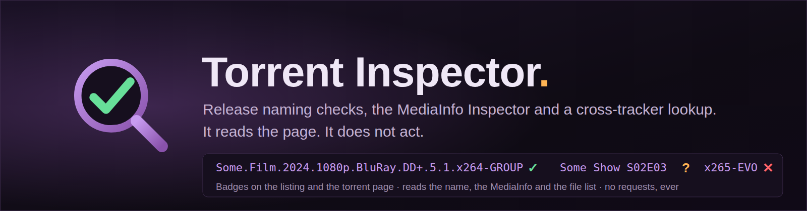

# Torrent Inspector

A Tampermonkey userscript for moderators of UNIT3D trackers: release-name checks against
the tracker's own rules, a MediaInfo inspector, a cross-tracker lookup, and a source check
that compares an upload with the same release on other trackers. It reads the page in
front of you and stores its settings locally. Optional read-only API access uses your
own key for each tracker. An always-visible **Check other trackers** button opens a
dedicated search panel with resolution and group selected, matching IDs first, and
settings tucked away. Recommended home API searches, tracker choices and API-key setup stay in that same panel. Unsupported API destinations have an explicit website fallback. API results show upload dates and sort oldest first within each comparison group. Results also compare v1 torrent info hashes when both APIs expose them; different hashes can still contain the same media. Each expanded result offers separate Copy MediaInfo and Copy description buttons. They also update the page's Source row. It never posts
or submits changes to a tracker.

**[torrent.dkokto.dev](https://torrent.dkokto.dev/)** describes it with screenshots and
carries the [Rules builder](https://torrent.dkokto.dev/rules.html) for writing a rules
profile of your own.

## Getting the script

The script is handed out privately to moderators and staff of the trackers it serves, and
is not published for download here or anywhere else: it carries a directory of each
tracker's internal groups, and some trackers would rather that list were not public. If
you moderate on a supported tracker, ask **DKOKTO** there and you will be sent the address;
it installs in one click and updates itself from that address.

## Reporting a group

The [group-report form](https://github.com/khamere/torrent_inspector/issues/new?template=group-report.yml)
in this repository's Issues is the one public part of the project: tell it a group's home
tracker, or that it is scene, and where that can be checked. A person reads each report.

Offered as-is, a personal project.
